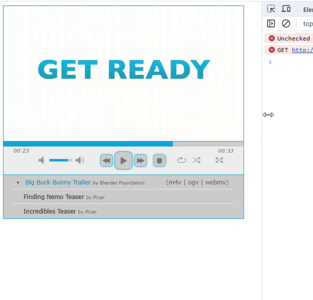

# jplayer-playlist-responsive
Makes jplayer playlists reponsive to smaller screen sizes

Add the dist-responsive folder to your project, then add this reference on your jplayer playlist pages
 <link href="dist-responsive/skin/jplayer.playlist.responsive.css" rel="stylesheet" />

